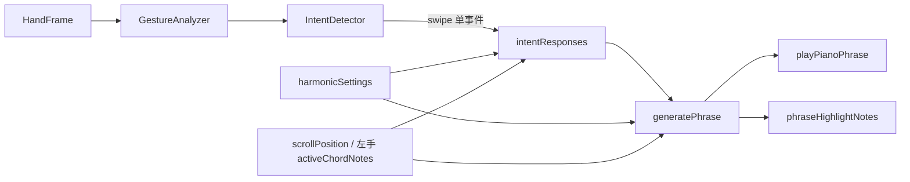

# 右手意图设计说明

> 文档日期：2026-06-12（2026-06-12 修订：对齐调性和声联动、八度视口、检测规格文档）  
> 关联代码：`IntentDetector`、`aiPianoEngine`、`intentResponses`、`melodicGravity`  
> 检测层规格见 [GESTURE-RECOGNITION.md](./GESTURE-RECOGNITION.md) §7

---

## 1. 问题陈述

当前右手挥动（→ ← ↑ ↓）触发的是 **AI Piano Phrase**——一串 0.5–1.5 秒内连续播放的音符，并同步高亮琴键。

许多使用者反馈：**滑动过程中更像在「扫键」**，而不是在表达清晰的「音乐意图」。  
本文档解释**现有设计在做什么**、**为何会产生扫键感**，以及**后续可如何改进**。

> **架构层面**：下文 §2–§4 的「方向 → 模板短语 → 批量播放」模型**仍然成立**；P0–P3 改进项**大多尚未实现**。  
> **实现细节**：§3 已更新为当前代码（调性 + 和弦音联动、连续八度视口等），与初版描述有差异。

---

## 2. 设计初衷（我们想要什么）

右手被定义为 **「旋律/表情手」（Expression Hand）**，职责是：

| 挥动方向 | 映射行为 | 期望的音乐语义 |
|----------|----------|----------------|
| → 右挥 | `ascend` | 乐句上行、能量抬升 |
| ← 左挥 | `descend` | 回落、收句 |
| ↑ 上挥 | `lift` | 高音 accent、情绪升起 |
| ↓ 下挥 | `settle` | 稀疏低音、段落缓和 |

双手张合则负责 **宏观空间**（`climax` / `intimate`），与右手分工不同。

核心思想：**一次挥动 = 一个完整音乐「手势语句」**，而不是单点按键。  
类比指挥：手臂划过空气，乐队应感受到「句法」，而非「按了哪几个键」。

---

## 3. 当前实现（实际发生了什么）

### 3.1 检测层

```
摄像头帧 → GestureAnalyzer（速度 vx/vy、张开度、逐指状态）
         → IntentDetector.detectExpression()  （仅 MediaPipe Right 手）
         → 若 |velocity| ≥ 0.42 且 |vx|/|vy| 超阈值 且 轴比满足 → swipe 事件
```

关键参数（`gesture/lib/intent/config.ts`，详见 [GESTURE-RECOGNITION.md §7](./GESTURE-RECOGNITION.md)）：

- `SWIPE_VX_THRESHOLD` / `SWIPE_VY_THRESHOLD`：**0.5**
- `SWIPE_AXIS_RATIO`：**1.15**
- `SWIPE_COOLDOWN_MS`：**480 ms**
- 速度模长门槛：**0.42**（`intentDetector.ts` 内硬编码）

**特点**：只关心 **整段挥动的结果方向**，不跟踪挥动路径上的连续姿态。（与初版一致）

### 3.2 响应层

```
swipe 事件 → behaviorFromSwipe(direction)
          → generatePhrase({
                behavior, direction,
                harmonicKey,      // 和弦映射面板所选调性
                chordNotes,       // 左手按住和弦 或 I 级参考和弦
                octaveStart,      // 来自键盘 scrollPosition 视口
                energy, tension, strength, memory
             })
          → audioEngine.playPianoPhrase(notes[])
          → phraseHighlightNotes 高亮全部短语音符（仍为整句高亮，非流动光标）
```

**相对初版文档的变化**：

| 项目 | 初版文档 | 当前实现 |
|------|----------|----------|
| 音阶来源 | `musicState.scale`（UI 可选音阶） | **`harmonicKey`**（和弦映射调性） |
| 和弦参考 | `musicState.chord` 字符串 | **`chordNotes[]`** 实际音高 |
| MusicMode | UI 可选 dream/pulse/drift/ritual | **内部固定 `dream`**（UI 已移除） |
| 音区锚点 | 固定 C3 附近 | **`octaveStart` 随键盘连续视口平移** |

### 3.3 短语生成（`aiPianoEngine`）

1. 根据 `behavior` 确定 MIDI 音区模板（如 ascend 52–68+energy），再 **`+ (octaveStart - 3) × 12` 平移**
2. 在 **`buildGravityPoolForHarmony(chordNotes, harmonicKey)`** 引力池内游走生成 2–5 个音  
   - 和弦音在池中 **3 倍加权**  
   - 经过音来自 **当前调性音阶**（`buildKeyScaleNotes`）
3. 路径生成优先 **当前 `chordNotes` 音高类**，`pickPassingTone` 允许调内经过音
4. `phraseRhythm(strength, behavior, mode='dream')` 分配间隔与力度
5. 非和弦音 velocity × **0.88**
6. 一次性 schedule 所有 `triggerAttackRelease`

**和弦上下文规则**（`intentResponses.playPhrase`）：

- 左手 **按住** → `referenceChordNotes = activeChordNotes`
- **未按住** → 当前调 **I 级**和弦（与和弦映射面板一致）

**结果**（与初版一致）：用户看到琴键 **依次亮起**（当前仍为 **整句所有音同时高亮**），听到连续音串——视觉上仍像「扫键」。

---

## 4. 为何像「扫键」而非「意图」

| 维度 | 用户直觉中的「意图」 | 当前实现 |
|------|---------------------|----------|
| **时间结构** | 一次挥动 → 一个可命名的音乐概念（问句/答句/叹息） | 一次挥动 → N 个离散 noteOn，间隔固定随机 |
| **空间结构** | 挥动幅度/速度连续影响音高线形状 | 方向只决定 behavior 模板，幅度仅影响 strength→密度 |
| **视觉反馈** | 手与声音强耦合（手在哪，声在哪） | 短语音高由算法在池内选取，**与手的位置无关** |
| **因果链** | 「我向上推」→「音高被推高」 | 「检测到 up swipe」→「播放 lift 模板」 |
| **重复性** | 同一意图可有变化 | 同一方向多次触发，听感均为相似的上行/下行音型 |

**根本原因**：

1. **离散事件 + 批量播放**：Intent 是单帧 FSM 输出，音乐是离线生成的 note 列表。  
2. **缺少连续映射**：MediaPipe 轨迹未参与音高/时值的实时计算。  
3. **高亮全部短语键**：UI 强化「扫键」联想，而非「一句乐语」。

因此，当前系统更准确的名字是：**「方向触发的程序化短语」**，而非 **「连续手势→连续音乐」**。

---

## 5. 与左手的设计对比

| | 左手 | 右手 |
|---|------|------|
| 输入 | 伸指数量（离散 1–5） | 挥动方向（离散 4 向） |
| 输出 | 持续和弦（按住） | 短时短语（一次性） |
| 映射 | **I–V 级数**（随调性/和弦类型自动算符号） | 方向 → 模板短语（ascend/descend/lift/settle） |
| 和声上下文 | 自身即和声源 | **引用左手和弦或 I 级** 驱动旋律引力池 |
| 用户可控性 | 高（和弦映射面板：调性/三·七/Power/转位） | 低（间接通过左手与调性；只能调 swipe 阈值） |

左手「3 指 = iii 级」清晰；右手「右挥 = ascend 模板」对用户仍是 **半黑盒**（但生成内容已与调性/和弦一致）。

---

## 6. 现有数据流（便于改架构）



**断点**（未变）：C→D 之间仍丢失 `HandFeatures` 的连续轨迹（vx/vy 序列、路径、持续时间）。

**已增强**（阶段 10）：D→E 之间已接入 **调性 + 和弦音**，旋律与左手和声一致；**未**接入手部空间位置。

---

## 7. 改进方向（建议优先级）

### P0 — 感知层（不改检测，先改反馈）

- [ ] 短语高亮改为 **流动光标**（仅亮当前音），减少扫键视觉  
      （注：单键已是整键高亮样式，但短语仍为 **全 note 列表同时高亮**）
- [ ] 添加 **意图标签 HUD**（「上行 / 收句 / 升起」）强化语义
- [ ] 同一 behavior 增加 2–3 套 phrase 模板，降低重复感

### P0b — 和声联动（阶段 10 已完成）

- [x] 旋律引力池改为 **harmonicKey + chordNotes**（非独立 UI 音阶）
- [x] 左手按住时右手优先 **当前和弦音**；否则 **I 级**
- [x] 音区随 **键盘 scrollPosition** 平移

### P1 — 连续映射（轻量）

- [ ] 挥动 **持续时间** → 短语长度；**峰值速度** → 力度曲线
- [ ] 挥动 **起点/终点 Y** → 短语起始音区（而非纯模板）
- [ ] 引入 **挥动过程中的 preview 线**（Canvas 显示预期音高轮廓）

### P2 — 架构升级

- [ ] **GestureStream**：在 swipe 开始/进行中/结束三阶段发事件
- [ ] **实时音高跟随**：右手 X/Y 映射到 scale 池索引（类似废弃的空气钢琴，但只控制短句轮廓）
- [ ] **句法层**：Markov / 风格库，让 ascend 有多种「问句型/进行型」

### P3 — 产品语义

- [ ] 设置中暴露 **右手灵敏度、冷却、phrase 风格**
- [ ] 「练习模式」：显示期望挥动与生成乐句的对照
- [ ] 可选 **「指挥模式」**：短语更稀疏、留白更多，减少 note 数量

---

## 8. 若保留当前架构，文档应如何描述

对用户说明时，建议诚实表述：

> 右手挥动 **不会** 像空气钢琴那样「手在哪弹哪」。  
> 它触发的是基于 **当前调性** 与 **左手和弦（或 I 级）** **自动生成的一句短旋律**；方向决定句型（上行/下行/高音/低音），挥动速度影响密度与力度。  
> 旋律会优先使用当前和弦音，并允许同调经过音。

避免使用「精确意图识别」等措辞，以免与扫键体验冲突。

---

## 9. 相关文件

| 文件 | 职责 |
|------|------|
| [GESTURE-RECOGNITION.md](./GESTURE-RECOGNITION.md) | 右手 swipe / 双手 expand 检测阈值 |
| `gesture/lib/intent/intentDetector.ts` | swipe / expand / compress 检测 |
| `gesture/lib/intent/config.ts` | 阈值与 cooldown |
| `music-intent/lib/intentResponses.ts` | 意图 → 音频 + 状态；和弦上下文注入 |
| `music-intent/lib/aiPiano/aiPianoEngine.ts` | 短语生成；八度平移 |
| `music-intent/lib/aiPiano/melodicGravity.ts` | `buildGravityPoolForHarmony` |
| `music-intent/lib/diatonicHarmony.ts` | 调性音阶与 I 级和弦 |
| `music-intent/lib/aiPiano/phraseRhythm.ts` | 节奏与力度（默认 dream） |
| `stores/pianoStore.ts` | `scrollPosition` → `octaveStart` |
| `gesture/components/ConductGuideCard.tsx` | 用户向说明 |

---

## 10. 总结

**体验模型（未变）**：当前右手 = 离散方向触发 + 程序化多音短语 + 整句全键高亮 → 仍接近扫键感。  
**和声模型（已升级）**：短语已与 **调性 + 左手和弦** 联动，听感更贴合当前和声。  
**设计目标（未达）**：一次挥动表达一句乐语 → 仍需 P0 感知层 + P1 连续映射。

后续迭代建议仍从 **P0 感知层** 入手（流动高亮、意图 HUD、phrase 模板），再评估 P1 连续映射。
